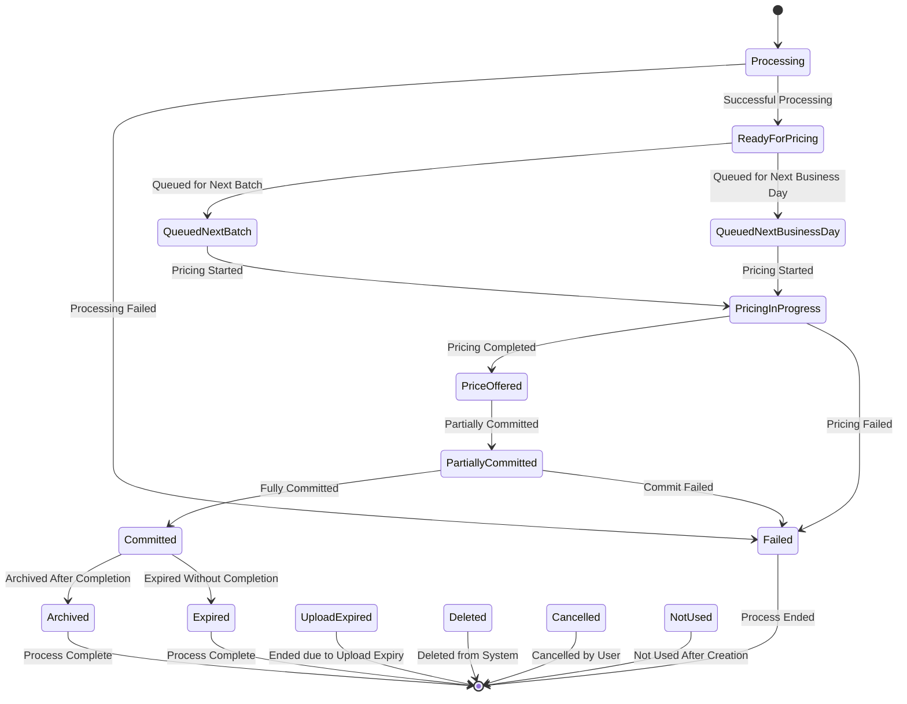

```mermaid
stateDiagram-v2
    [*] --> Processing
    Processing --> Failed : Processing Failed
    Processing --> ReadyForPricing : Successful Processing
    ReadyForPricing --> QueuedNextBatch : Queued for Next Batch
    ReadyForPricing --> QueuedNextBusinessDay : Queued for Next Business Day
    QueuedNextBatch --> PricingInProgress : Pricing Started
    QueuedNextBusinessDay --> PricingInProgress : Pricing Started
    PricingInProgress --> PriceOffered : Pricing Completed
    PricingInProgress --> Failed : Pricing Failed
    PriceOffered --> PartiallyCommitted : Partially Committed
    PartiallyCommitted --> Committed : Fully Committed
    PartiallyCommitted --> Failed : Commit Failed
    Committed --> Archived : Archived After Completion
    Committed --> Expired : Expired Without Completion
    Archived --> [*] : Process Complete
    Expired --> [*] : Process Complete
    Failed --> [*] : Process Ended
    UploadExpired --> [*] : Ended due to Upload Expiry
    Deleted --> [*] : Deleted from System
    Cancelled --> [*] : Cancelled by User
    NotUsed --> [*] : Not Used After Creation
```
